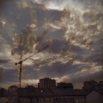
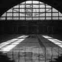
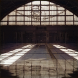
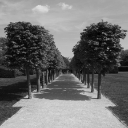
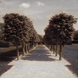

# Image_Colorization
## Why was this made
This project was made for hacathon conducted by IITG.AI club, IIT Guwahati.

I achieved rank 2 in this hackathon.

## How does it work
This AI works on basis of Autoencoders. It works using bottleneck architecture. First the Convolutional Layers works as encoders and Transposed Convolutional Layers decodes the image.

It converts gray scale image to LAB color space. 

It also uses skip connections from encoder layers to decoder layers to avoid the problem of vanishing gradients and so that gradient can backpropogate faster.

## Model Details
totals params= 100k
Loss function: MSE
Optimiser: RMSprop
output activation: Sigmoid

# Examples
Input | output
:------------:|:-----------:
| 
| 
| 
| 
| 
| 

